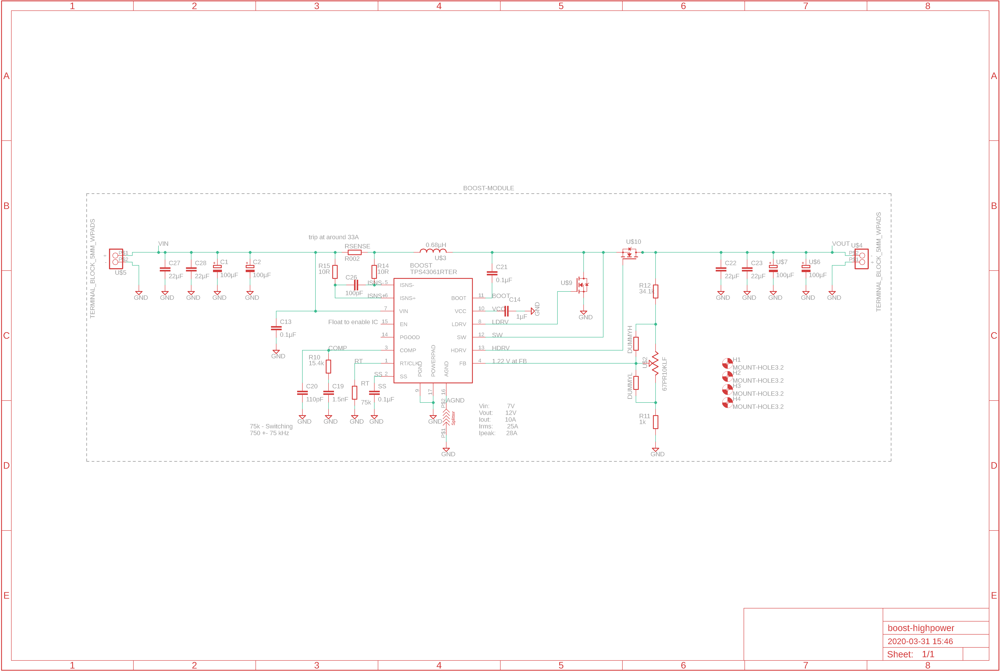

# Boost highpower
> Created by Oskar Johansson

**This module is a synchronous boost module when the cheap 2A boost no longer works.**   

## Goals 
> Goals of this project
```
- Create a boost converter for at least 10A 
- Handle 5 - 40 V input 
- Handle 5 - 60 V output
```


## Directories 
```
Boost highpower
├── document        # Generic document folder
│   ├── datasheet   # Datasheet for hardware components  
├── hardware        
│   ├── pcb         # Schematic, layout and production files
│   │   └── gerber  # Production files
│   │   └── library # Library for project
└── img        # Thermal tests 
  ```
  

## Hardware 
> The hardware is pretty much the same used in Robot-SM project [RobotSM20-linefollower](https://github.com/caselabbet/robotsm20-linefollower) with following changes 
```
- Input capacitor to handle 5 - 35 V 
- Output capacitor to handle 5 - 55 V
- Potentiometer to control output
- Terminal blocks for wire
- Wide solderpads to solder wire 
```
The boost is consisting of a TPS43061, which is a *synchronous boost controller*, i.e. uses two external transistors instead of one transistor and a diode. This minimizes the losses in the diode that would have been about 5 - 7 W at 10A. 

When using the provided trimpot together with the resistors there is a hardware limit that unables to go beyond 55 V to output. Since the feedback reference is 1.22 V, you can find two resistors together with a trimpot to hold a certain intervall, as in the Matlab below.
```matlab
% Vfeedback is 1.22V 
syms Rsl Rsh
Rtrim = 10000;    
Vouth = 55;
Voutl = 5; 
eq1 = Voutl == 1.22*((Rsh)/(Rsl+Rtrim)+1);
eq2 = Vouth == 1.22*((Rsh+Rtrim)/(Rsl)+1);
solution = solve([eq1,eq2]);
Rsl = double(solution.Rsl);
Rsh = double(solution.Rsh);
Rshl_disp = sprintf('Resistor feedback with 10k trimpot, Rsl: %d Ohm, Rsh: %d Ohm \nGives a Vout of 5 to 55 V',Rsl,Rsh);
disp(Rshl_disp)
```
### Schematic 

### Rendered images


## Usage of the boost module 
```
- Connect inputside to 4.5 - 35 V. 
- Control with an multimeter the output.
- Connect the output.
```

## License
> This project is created with MIT license. 

[](http://badges.mit-license.org)
